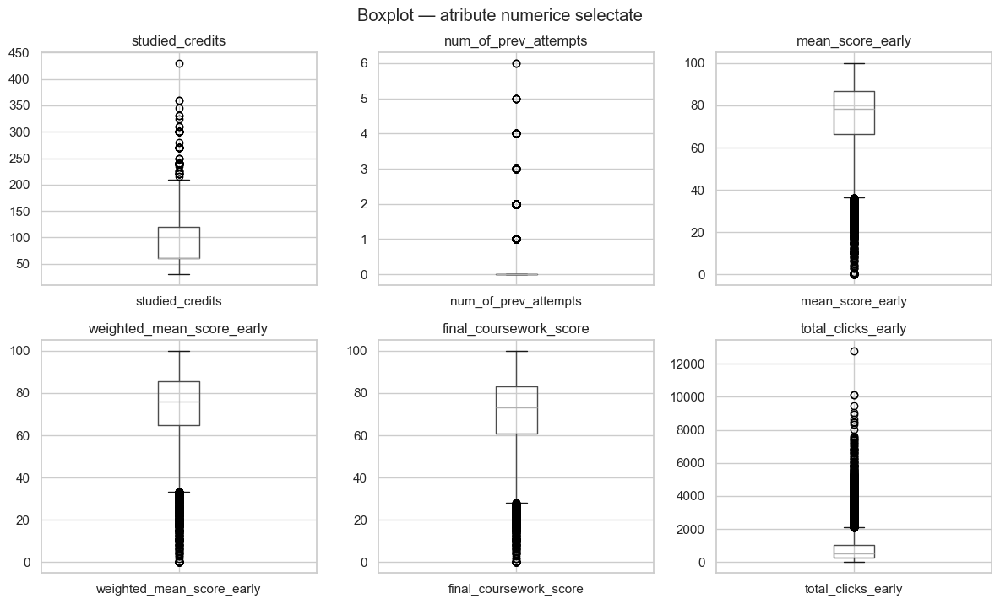
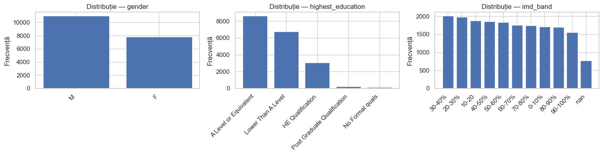
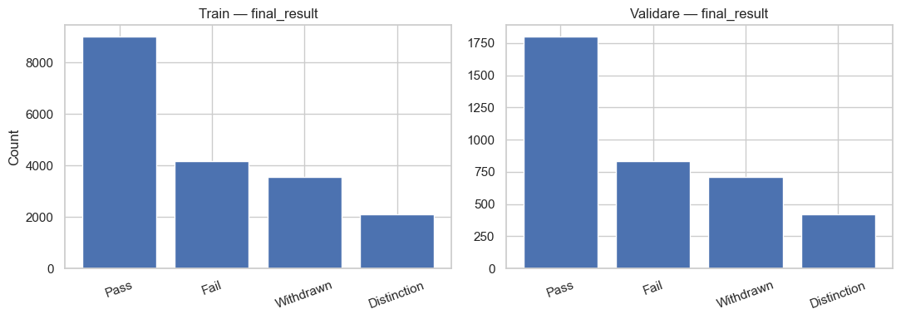
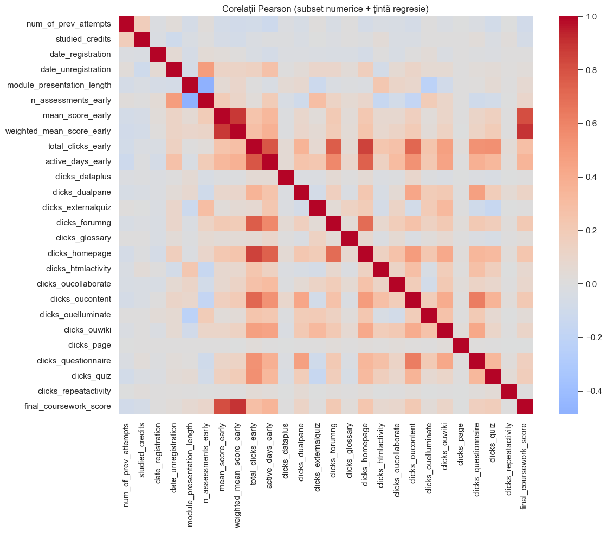
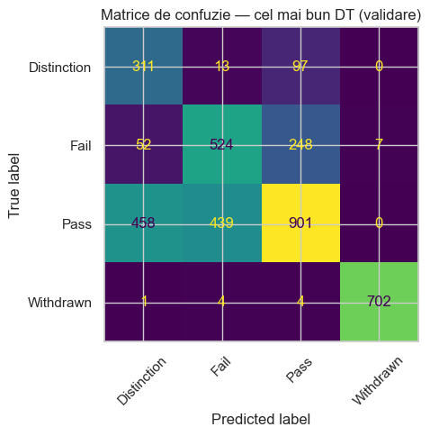
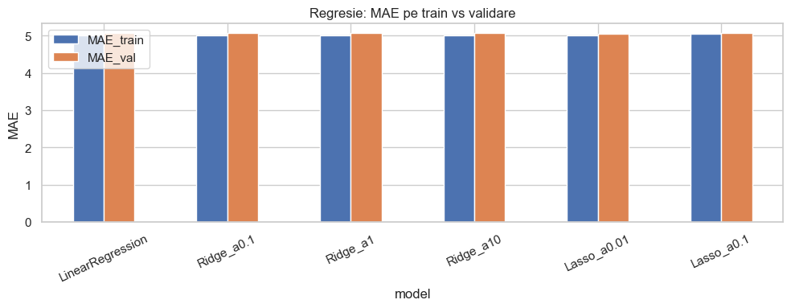
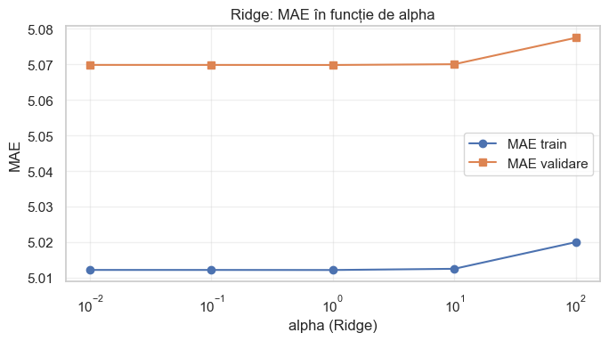

# Machine Learning pe OUALD — Clasificare și Regresie

**Curs:** Introducere în Machine Learning (ACS, UPB)  
**Autor:** [Andrei Văleanu](mailto:andrei.valeanu03@stud.acs.upb.ro)  
**Dataset:** [Open University Learning Analytics Dataset (OUALD)](https://analyse.kmi.open.ac.uk/open-dataset/help/overview)

Proiect complet de machine learning pe datele studenților OUALD: analiză exploratorie (EDA), preprocesare, modele de la baseline la boosting, predare Moodle și competiții bonus **Kaggle**.

---

## Prezentare generală

| Sarcină | Țintă (target) | Metrică |
|---------|----------------|---------|
| **Clasificare** | `final_result` (Pass / Fail / Withdrawn / Distinction) | **Accuracy** (acuratețe) |
| **Regresie** | `final_coursework_score` (0–100) | **MSE** (Mean Squared Error) |

Structura din notebook urmează cerința temei:

1. **3.1** — EDA (Exploratory Data Analysis, analiză exploratorie)
2. **3.2** — Preprocesare (valori lipsă, outlieri IQR, scalare, encodare)
3. **3.3** — Modele: Decision Tree, modele liniare, HistGradientBoosting, **CatBoost + blend XGBoost**

---

## Rezultate Kaggle (bonus)

| Competiție | Loc | Interval scor (normalizat) |
|------------|-----|----------------------------|
| **Clasificare** | **24** | de la **0,87** până la **1,00** (punctaj bonus maxim) |
| **Regresie** | **24** | de la **80,04** până la **2,36** (MSE — cu cât mai mic, cu atât mai bine) |

Predicțiile pentru Kaggle sunt generate separat față de Moodle (set de test diferit, pipeline dedicat în `kaggle_export.py`).

---

## Structura repository-ului

```text
ML-OUALD-Classification-Regression/
│
├── Tema1_IA_OUALD.ipynb          # Notebook principal (EDA → modele → export)
├── kaggle_export.py              # Script export Moodle + Kaggle (pipeline optimizat)
├── requirements.txt              # Dependențe Python
│
├── data/
│   ├── CB_OUALD_train.csv        # Antrenare — 18 802 rânduri
│   ├── CB_OUALD_test.csv         # Test Moodle — 4 700 rânduri
│   └── CB_private_test.csv       # Test privat Kaggle — 4 700 rânduri
│
└── docs/
    ├── project_description.tex   # Descriere academică (LaTeX)
    └── screenshots/              # Capturi din output-urile notebook-ului
```

---

## `kaggle_export.py` — ce face acum

Scriptul separă clar **Moodle** de **Kaggle**:

| | Moodle | Kaggle |
|---|--------|--------|
| **Seeds** | 3 (`42, 137, 271`) | 5 (`42, 137, 271, 509, 1013`) |
| **Regresie** | CatBoost, depth=8, anti-overfit | CatBoost + blend XGBoost (pondere calibrată pe validare) |
| **Clasificare** | CatBoost + feature stacking OOF | Același stacking + blend XGB; predicții pe `CB_private_test.csv` |
| **Fișier export** | `CB_OUALD_predictii_tema1.csv` | `kaggle_TEMA1_CB_clasificare_2026.csv`, `kaggle_TEMA1_CB_regresie_2026.csv` |

Detalii tehnice:

- **Stacking:** predicții out-of-fold (OOF) de regresie ca feature `_pred_score_reg` pentru clasificare
- **Blend CatBoost / XGBoost:** ponderile `w_cat_clf` și `w_cat_reg` se aleg pe un holdout intern (15%)
- **Clampare regresie** în `[0, 100]` — intervalul realist al scorului
- **Fix important:** clasificarea Kaggle folosește predicțiile pe setul privat (`pck`), nu pe setul Moodle (`pcm`)

Rulare (din rădăcina proiectului):

```bash
python kaggle_export.py
```

Durata tipică: **30–90 minute** (CatBoost + XGBoost pe tot setul de antrenare).

---

## Capturi din notebook (output nemodificat)

### EDA — distribuția claselor `final_result`



*Se observă dezechilibrul claselor (Pass dominant). La clasificare contează atât accuracy cât și performanța pe clase rare (Withdrawn, Distinction).*

### EDA — corelații cu scorul de curs



*Variabile precum `weighted_mean_score_early` și `mean_score_early` sunt puternic legate de ținta de regresie.*

### EDA — variabile categorice



*Analiză pe module, educație, bandă IMD — utile pentru CatBoost (categorii native).*

### EDA — distribuții numerice



*Distribuții skewed; de aici vine tratamentul outlierilor IQR pe `total_clicks_early`.*

### Matrice de confuzie (validare)



*Performanța clasificatorului pe split-ul de validare.*

### Comparație modele




*Comparație Decision Tree, modele liniare, HGB, CatBoost.*

### CatBoost + XGBoost pe validare (text din celula 45)

```
CatBoost clasificare — câștigător validare: d9_lr0.045 | acc validare: 0.7078 | iter (best): 438
CatBoost regresie — câștigător validare: d9_cons | MSE validare: 46.7801 | iter (best): 964
XGBoost — blend validare: cfg_clf= xd10 cfg_reg= xr7_s | w_cat_clf= 0.255 | acc blend val ~ 0.7602 | w_cat_reg= 0.609 | MSE blend val ~ 46.3773
```

---

## Quick start

### 1. Clone și instalare

```bash
git clone https://github.com/AndreiValeanu22/ML-OUALD-Classification-Regression.git
cd ML-OUALD-Classification-Regression
python -m venv .venv
```

Windows:

```powershell
.venv\Scripts\activate
pip install -r requirements.txt
```

Linux / macOS:

```bash
source .venv/bin/activate
pip install -r requirements.txt
```

### 2. Rulează notebook-ul

```bash
jupyter notebook Tema1_IA_OUALD.ipynb
```

Deschide folderul proiectului ca director de lucru. Rulează celulele de sus în jos; prima celulă de cod instalează dependențele cu `%pip install -r requirements.txt`.

> CSV-urile sunt în `data/`. Dacă notebook-ul nu le găsește: `copy data\*.csv .` (Windows).

### 3. Generează predicțiile

```bash
python kaggle_export.py
```

| Fișier generat | Destinație |
|----------------|------------|
| `CB_OUALD_predictii_tema1.csv` | Moodle / arhivă |
| `kaggle_TEMA1_CB_clasificare_2026.csv` | Kaggle — clasificare |
| `kaggle_TEMA1_CB_regresie_2026.csv` | Kaggle — regresie |

---

## Metode (pe scurt)

- **Preprocesare:** imputare mediană/modă, mascare outlieri IQR, `StandardScaler` + one-hot pentru sklearn; DataFrame brut pentru CatBoost/XGBoost
- **Baseline:** `DecisionTreeClassifier`, `LogisticRegression`, `Ridge` / `Lasso`
- **Boosting:** `HistGradientBoosting`, CatBoost (grid search), blend XGBoost
- **Kaggle:** ensemble multi-seed, stacking OOF regresie, export separat față de Moodle

---

## Tehnologii

Python 3.11+ · pandas · NumPy · scikit-learn · CatBoost · XGBoost · matplotlib · seaborn · Jupyter

---

## Notă despre contribuții

În istoricul Git poate apărea `Co-authored-by: Cursor <cursoragent@cursor.com>` — agentul m-a ajutat **doar** să structurez și să public proiectul pe GitHub (README, structură repo, push). Modelele, notebook-ul, experimentele și rezultatele Kaggle sunt lucrate de mine.
